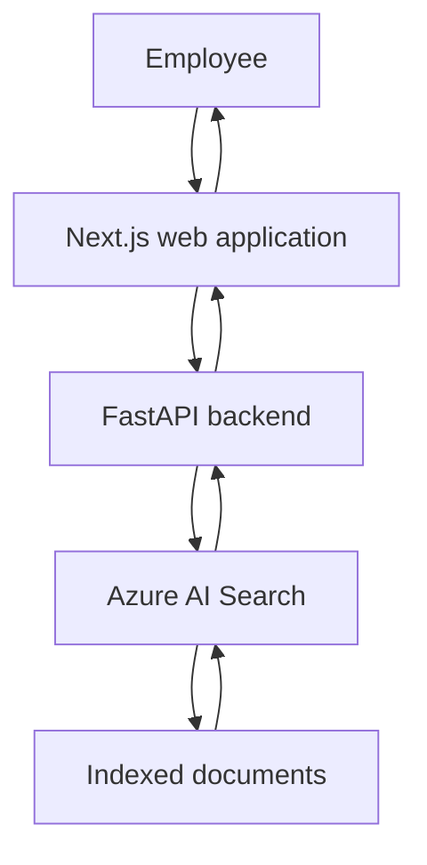
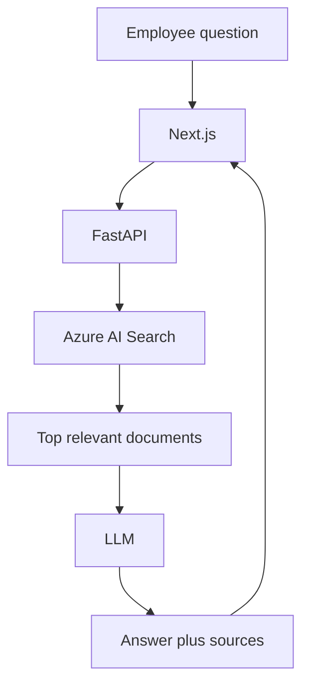

# Architecture

Version 1 is a search application. Employees ask a question, the system retrieves relevant company documents, and the UI displays those documents. There is no LLM answer generation in this version.

## Request flow

## Component responsibilities

| Component | Responsibility |
| --- | --- |
| Next.js | Question form, loading/empty/error/no-result states, display of `SearchResult` records |
| FastAPI | Validate requests, CORS, logging, search orchestration |
| Search service | Provider selection (`mock` or `azure`) and mapping to the internal result model |
| Azure AI Search | Keyword search, and hybrid search when a vector field is configured |

The browser never calls Azure Search. The Azure API key stays on the backend.

## Internal search model

Frontends depend on this API shape, not on Azure-specific payloads:

- `id`
- `title`
- `content`
- `source`
- `category`
- `score`

## Search modes

- **Keyword:** `search_text` only. Default when `AZURE_SEARCH_VECTOR_FIELD` is empty.
- **Hybrid:** `search_text` plus `VectorizableTextQuery` against the configured vector field.
- **Semantic ranking:** optional, enabled when `AZURE_SEARCH_SEMANTIC_CONFIGURATION` is set.

## Version 1.1 (not implemented)

The service layer is intentionally thin so retrieval-augmented generation can be added later without changing the frontend contract for sources:

Version 1 stops after returning `docs` to the frontend.
