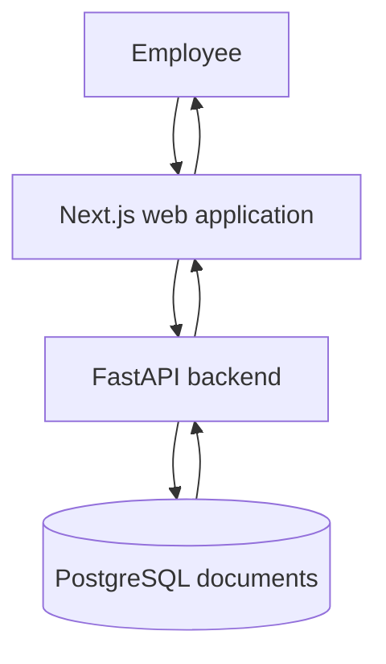
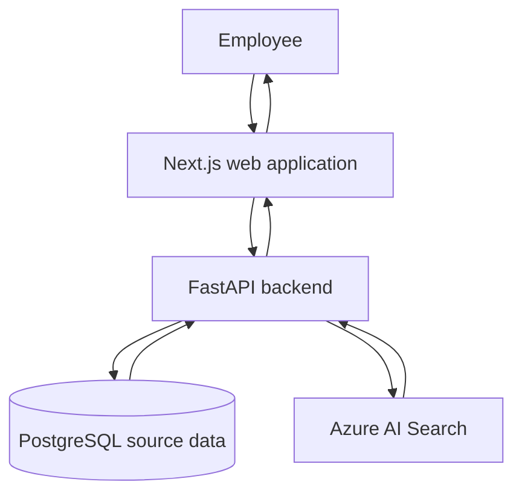
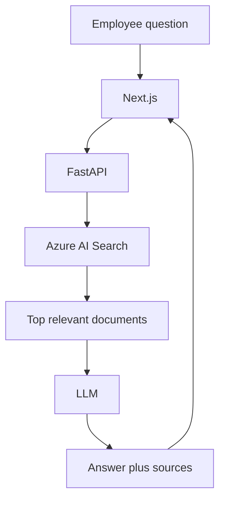

# Architecture

Version 1 is a search application. Employees ask a question, the system retrieves relevant company documents, and the UI displays those documents. There is no LLM answer generation in this version.

## Current local architecture

```
Next.js
  |
FastAPI
  |
PostgreSQL
  |
documents table
```

PostgreSQL is the **application/source data** store. Schema and sample data live in `database/scripts/`, not in the Python backend.



## Future architecture

```
FastAPI
  |
  +---- PostgreSQL
  |
  +---- Azure AI Search
```

Azure AI Search is the later **indexing/search** layer. It remains implemented as `SEARCH_PROVIDER=azure` but is not required for local development.



## Component responsibilities

| Component | Responsibility |
| --- | --- |
| Next.js | Question form, loading/empty/error/no-result states, display of `SearchResult` records |
| FastAPI | Validate requests, CORS, logging, search orchestration, PostgreSQL connection |
| Search service | Provider selection (`postgres`, `mock`, or `azure`) and mapping to the internal result model |
| `database/scripts` | Table creation and synthetic sample data |
| PostgreSQL | Local synthetic healthcare documents |
| Azure AI Search | Keyword search when `SEARCH_PROVIDER=azure` |

The browser never calls Azure Search. The Azure API key stays on the backend.

## Internal search model

Frontends depend on this API shape, not on Azure-specific payloads:

- `id`
- `title`
- `content`
- `source`
- `category`
- `score`

## Search providers

- **postgres:** parameterized SQL against `id`, `title`, `summary`, and `content`
- **mock:** static documents in `backend/app/data/documents.json`
- **azure:** keyword `search_text` against the configured Azure AI Search index

Hybrid/vector search is not enabled yet.

## Version 1.1 (not implemented)

The service layer is intentionally thin so retrieval-augmented generation can be added later without changing the frontend contract for sources:



Version 1 stops after returning `docs` to the frontend.
